-  Hoja 10 - CRITERIOS PARA EVALUAR LOS LENGUAJES DE PROGRAMACIÓN
- 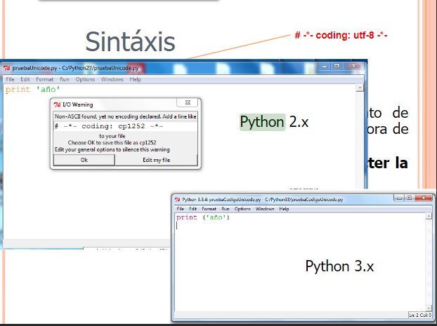 Hoja - 26 - SINTAXIS 
- 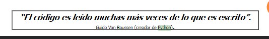 Hoja - 27 - SINTAXIS
- 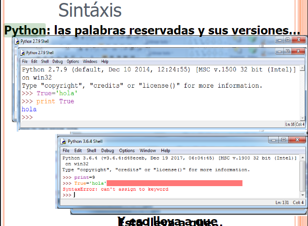 Hoja - 29 - SINTAXIS, Palabras reservadas
- 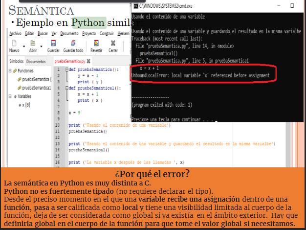 Hoja - 56 - SEMÁNTICA, Error semantico
- 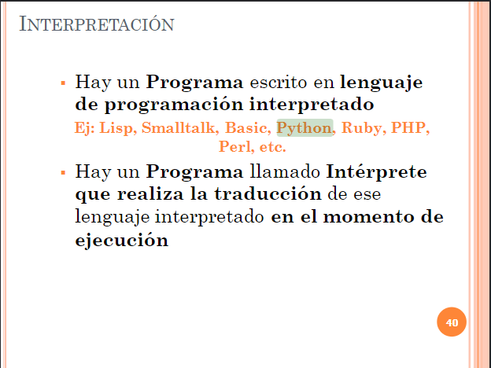 Hoja - 86 - Interpretación
- 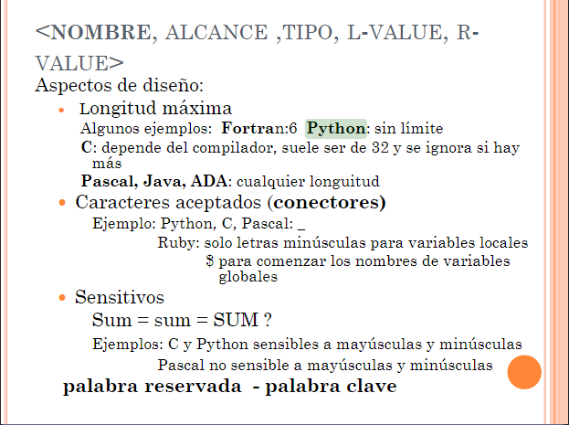 Hoja - 137 - Cantidad de caracteres en el nombre de un id, caracteres permitidos y case sensitive
-  Hoja - 145 - Alcance de las variables
- 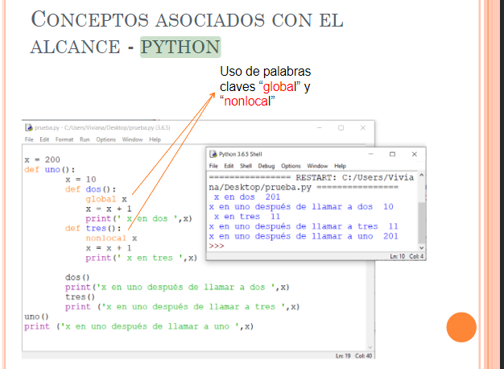 Hoja - 149 - CONCEPTOS ASOCIADOS CON EL ALCANCE 
- 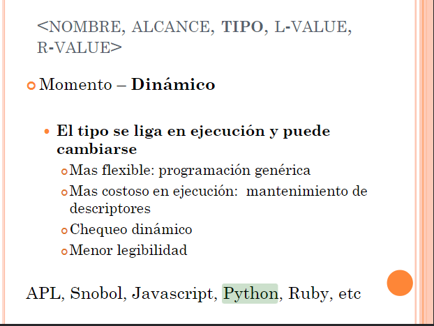 Hoja - 159 - Momento de ligadura
- 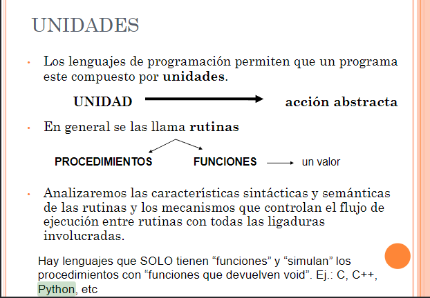 Hoja - 175 - Unidades 
- 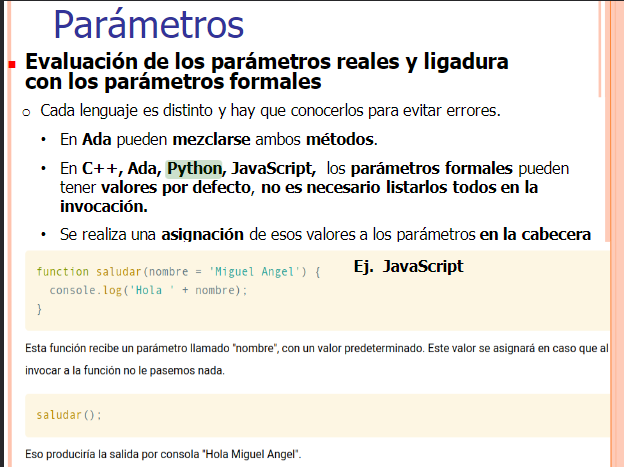 Hoja - 270 - Parametros
- 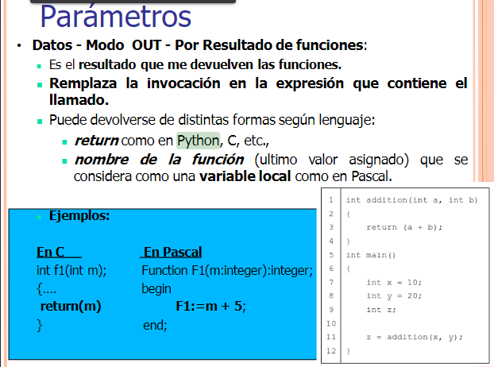 Hoja - 283 - Parametros (Resultado de funciones)
- 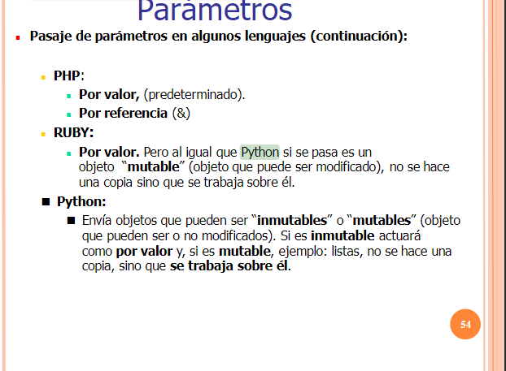 Hoja - 299 - Parametros (Datos) 
- 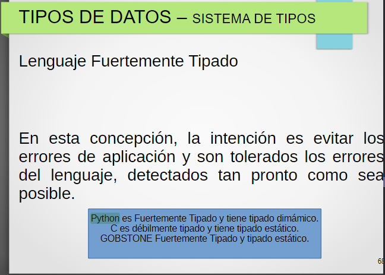 Hoja - 378 - Lenguaje fuertemente tipado
- 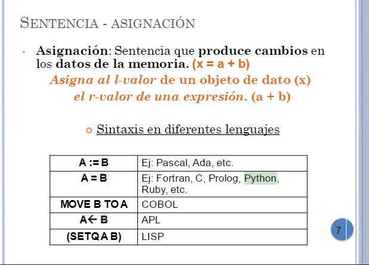 Hoja - 396 - Asignacion
- 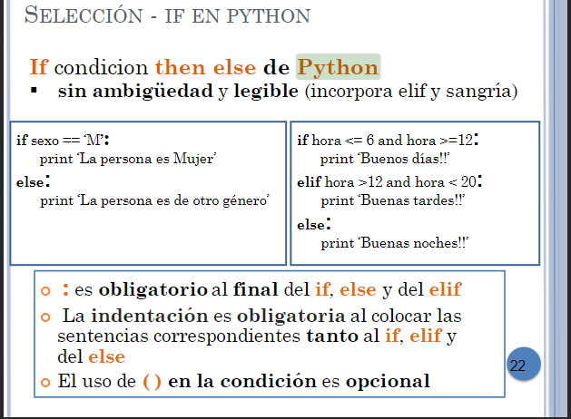 Hoja - 411 - Selección
- 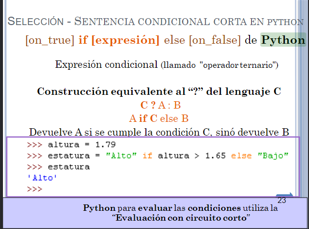 Hoja - 412 - Sentencia de seleccion
- 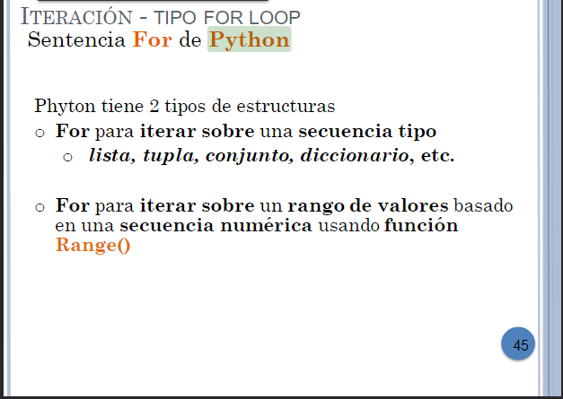 Hoja - 434 - Sentencia for 
- 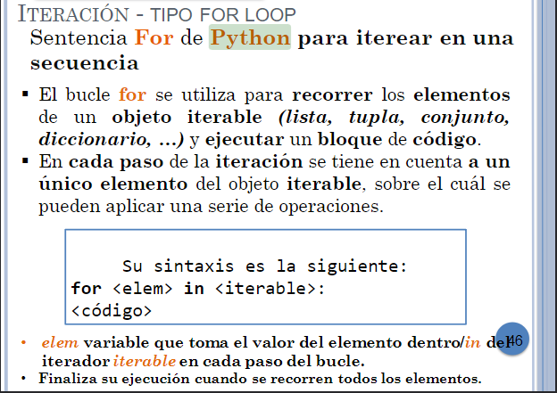 Hoja - 435 - Sentencia for
- 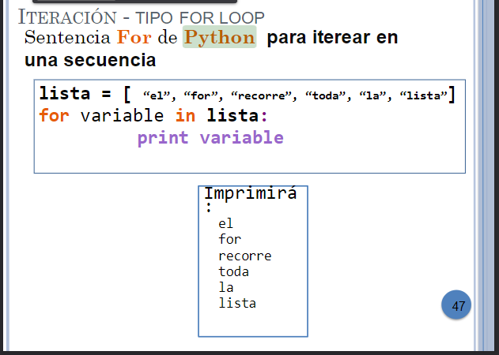 Hoja - 436 - Sentencia for
- 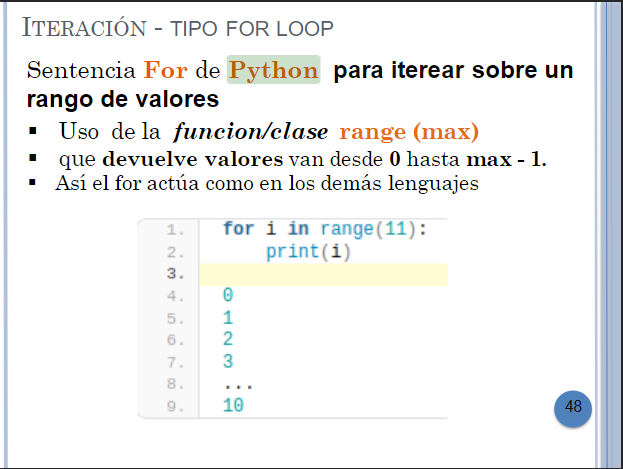 Hoja - 437 - Sentencia for
- 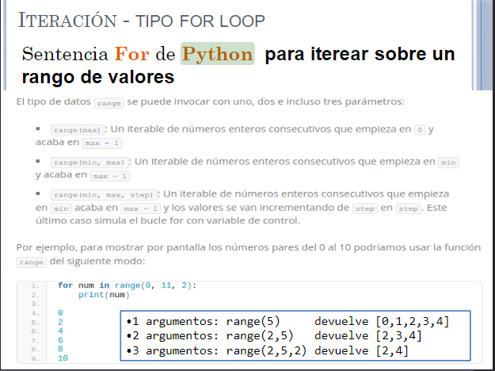 Hoja - 438 - Sentencia for
-  Hoja - 439 - Sentencia while
- 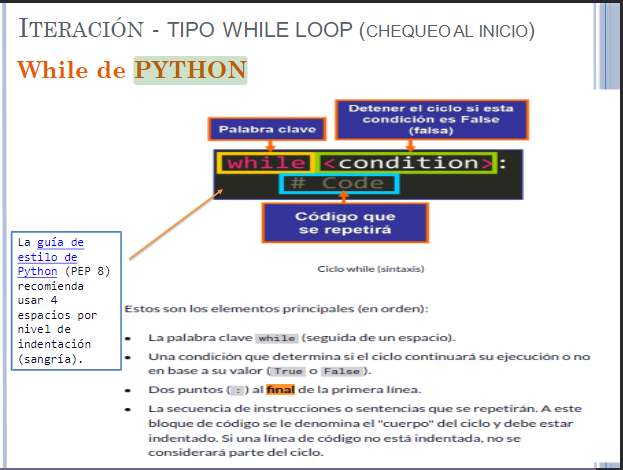 Hoja - 440 - Sentencia while
- 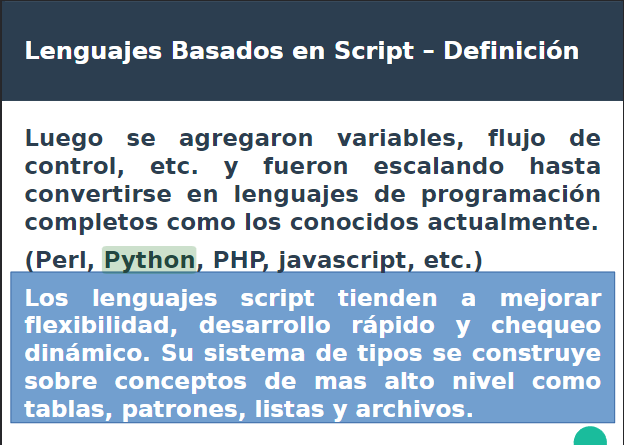 Hoja - 530 - Basado en Scripts
- 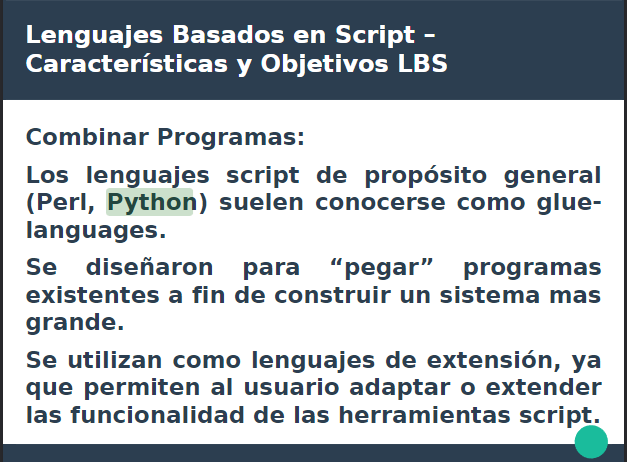 Hoja - 533 - Basado en Scripts
- 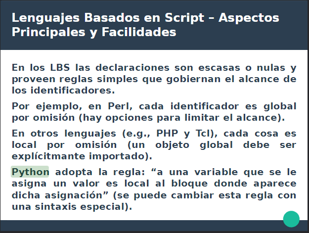 Hoja - 538 - Basado en Scripts
- 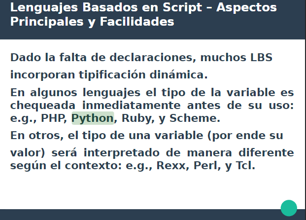 Hoja - 539 - Basado en Scripts
- 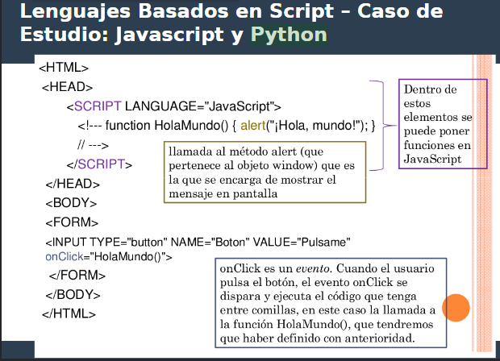 Hoja - 543 - Basado en Scripts
- 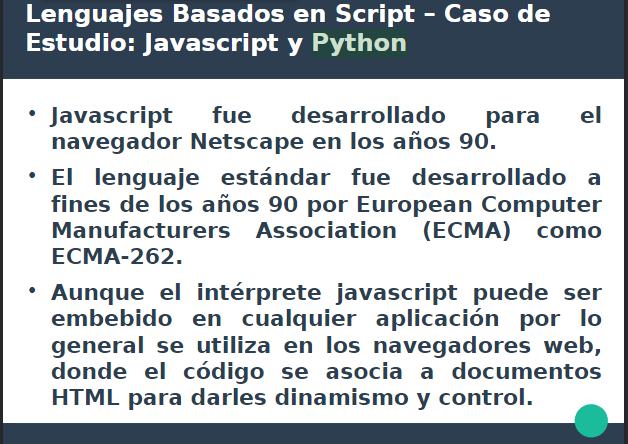 Hoja - 544 - Basado en Scripts
- 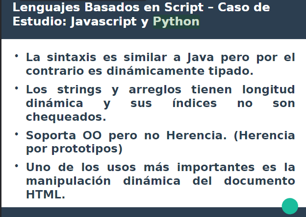 Hoja - 545 - Basado en Scripts
- 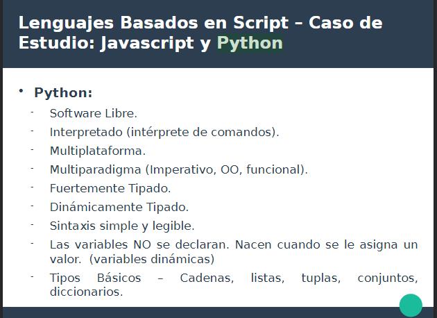 Hoja - 546 - Basado en Scripts